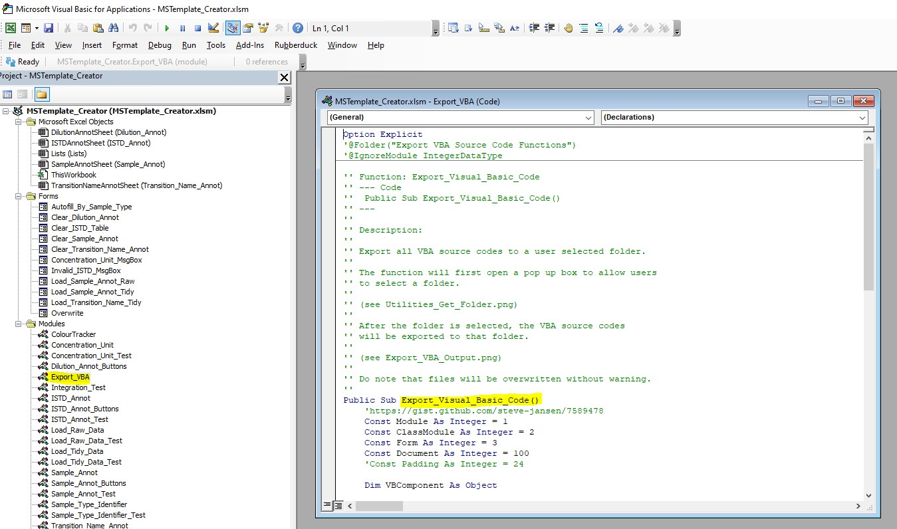

# Contributing to `MSTemplate_Creator`

First of all, thanks for considering contributing to `MSTemplate_Creator` 😄! We hope that you have found the tool useful in your work 😀 and we apologise for any mishaps 😣 along the way.

`MSTemplate_Creator` is an open source project, maintained by people who care.

## Acknowledgements 😌

This contributing file is based on a [template](https://gist.github.com/peterdesmet/e90a1b0dc17af6c12daf6e8b2f044e7c) from Peter Desmet released under CC0. 

## Versioning 🔢

Refer to the [NEWS.md file](https://github.com/SLINGhub/MSTemplate_Creator/blob/main/NEWS.md) to see what is being worked on as well as update to changes between back to back versions.

Software version numbers indicate following: `MAJOR.MINOR.PATCH.DEVELOPMENT`. 

Here are key steps to keep in mind:

-   The **major** version number generally do not increase unless the changes made affect a large group. Examples are moving the software to a new repository, changes to API, etc... 

-   When new features are added or (re)moved, we typically increase the **minor** version number.

-   Minimal, non breaking changes or bug fixes only are indicated by increasing the **patch** version number. Examples of minimal changes are are updating of documentations, fixing of typo in the software output and so on

-   Current development versions of our packages (i.e. main branch from GitHub) additionally have a **development** version number. The **development** version number is typically `9000`

## Code of conduct 👩‍🏫

Please note that this project is released with a [Contributor Code of Conduct](https://www.contributor-covenant.org/version/2/0/code_of_conduct/). By participating in this project you agree to abide by its terms.

## Ask a question ❓️

Using `MSTemplate_Creator` and got stuck? 
Browse the [Summary, Familiarisation and User Documentation](https://github.com/SLINGhub/MSTemplate_Creator/tree/main/docs) to see if you can find a solution. 

Still stuck? Post your questions as an [issue](https://github.com/SLINGhub/MSTemplate_Creator/issues) or [discussion](https://github.com/SLINGhub/MSTemplate_Creator/discussions) on GitHub. While we cannot offer quick user support, we'll try to do our best to address it, as questions often lead to better documentation 📚 or the discovery of bugs 🐛.

## Improve the documentation 📚

Noticed a typo ? 
Have a better example or dataset to explain a function? Good [documentation](https://github.com/SLINGhub/MSTemplate_Creator/tree/main/docs) makes all the difference, so your help to improve it is very welcome!

If you have just started on it, look at the Summary and Familiarisation file. 

If you need a step by step guide, use the User Documentation file.

If you need to understand the source code organisation and details, the Developer Documentation file will be useful.

We apologise that function documentation is not available at this moment and is still a work in progress. Do help us if you can.

I understand that some may prefer to have online documentation. Unfortunately, I do not have the expertise to do that for vba code at this point of time.

## Input data 📊

We understand that the types of input data `MSTemplate_Creator` can accept is limited. If there are other data, you believe the software could potentially expand. Do let us know and send us a shareable sample of this dataset. This is so that we can put this test data in our unit test and others who wish to contribute on this can have something to test on. We seek your understanding if the progress is slow as we have limited manpower and expertise. 

## Contribute code 📝

Care to fix bugs 🐛 or implement new functionality for `MSTemplate_Creator`? Great👏! Thank you for volunteering your time to help out. Have a look at the [issue list](https://github.com/SLINGhub/MSTemplate_Creator/issues) and leave a comment on the things you want to work on. See also the development guidelines below.

## Development guidelines 👨‍💻

### Micorsoft Excel
The current release of `MSTemplate_Creator` is run on a 64-bit Microsoft Excel 2019 application. We unfortunately, have a lack of experience if the excel macro file and its VBA codes will work on a 32-bit Microsoft Excel 2019 application or an older version of Excel.

### Excel VBA
Here are the summarised steps to manage the vba source code in excel, the full details can be found in the Developer Documentation file.

1. Refer to this [link](https://www.excel-easy.com/examples/developer-tab.html) to display the Developer Tab
2. Refer to this [link](https://spreadsheeto.com/vba-editor/) to understand how to open the vba editor and run a macro
3. Install [RubberDuck](http://rubberduckvba.com/) to create a fully integrated test environment. Here are some links to learn how to create unit tests
    * https://www.bernardvukas.com/testing/tutorial-excel-vba-unit-testing/
    * https://rubberduckvba.wordpress.com/2017/10/19/how-to-unit-test-vba-code/
    * https://rubberduckvba.wordpress.com/2019/01/05/code-insights-with-rubberduck-excel/
4. To export the vba source in excel modules and sheets to the src folder, run the function in the Export_VBA module. 

Refer to the Developer Documentation file to see a step by step guide on how to enable it. If there are alternative tools, do let us know. It will be helpful 🙏 if a step by step guide is also provided to help us learn and utilise these alternative tools quickly.

### README Documentation

For the README documentation, [Rmarkdown](https://rmarkdown.rstudio.com/) is used together with [R](https://www.r-project.org/) and [RStudio IDE](https://www.rstudio.com/products/rstudio/download/).

Here are some useful resources.
  * https://www.rstudio.com/resources/webinars/getting-started-with-r-markdown/ 
  * https://rmarkdown.rstudio.com/github_document_format.html

RStudio was used because of its friendly user interface (more button clicks than command lines) to create markdown and html document and to use git. Based on past experiences, it is easier to guide beginners to create html documents and use git using RStudio than pure command line. In addition, most people in the lab uses R. 

With the efforts made by the [R for Data Science Online Learning Community](https://www.rfordatasci.com/), they have created a learning environment via their [Slack account](http://r4ds.io/join) which make beginners more comfortable to ask question and share about R, RStudio, Rmarkdown, Git and GitHub issues. Give it a try to make your learning experience in R, Statistics, Git and GitHub a more fruitful experience that is worth sharing.

### GitHub Workflow

We try to follow the [GitHub flow](https://guides.github.com/introduction/flow/) for development.

1. Fork [this repo](https://github.com/SLINGhub/MSTemplate_Creator) and clone it to your computer. To learn more about this process, see [this guide](https://guides.github.com/activities/forking/).
2. If you have forked and cloned the project before and it has been a while since you worked on it, [pull changes from the original repo](https://help.github.com/articles/merging-an-upstream-repository-into-your-fork/) to your clone by using `git pull upstream main`.
3. Open the Excel file and open the vba editor. Ensure that [RubberDuck](http://rubberduckvba.com/) is installed.
4. Make your changes:
    * Write your code.
    * Test your code (bonus points for adding unit tests using [RubberDuck](http://rubberduckvba.com/) .
    * Document your code so that others can understand.
    * Run the existing unit test using [RubberDuck](http://rubberduckvba.com/) and aim for no errors.
    * Run the vba source code in the `Integration Test module` and aim for no errors. Refer to this [link](https://spreadsheeto.com/vba-editor/) to know how to run a macro
    * Export your module using [Excel VBA Developer Tools](http://vbatools.sourceforge.net/) or any alternative tools to the src folder.
5. Commit and push your changes.
6. Submit a [pull request](https://guides.github.com/activities/forking/#making-a-pull-request).

