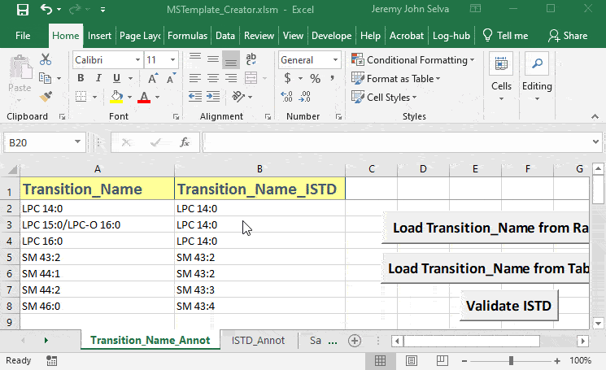
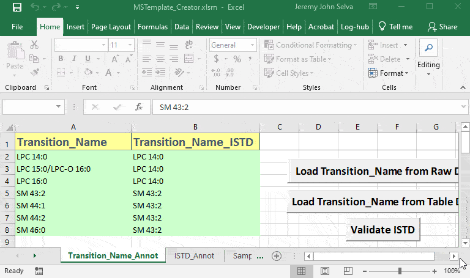
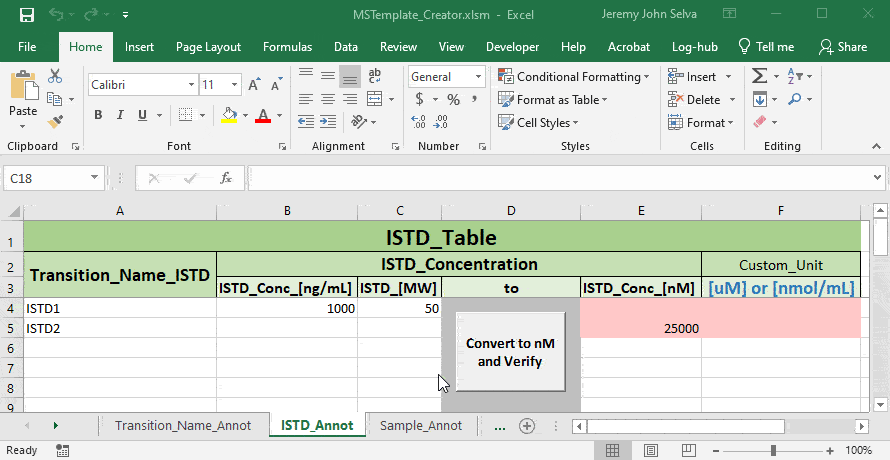
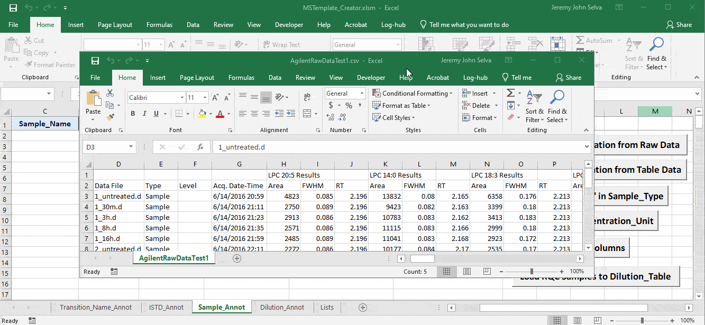

```{r, include = FALSE}
knitr::opts_chunk$set(
  collapse = TRUE,
  comment = "#>"
)
```

# MSTemplate_Creator

MSTemplate_Creator is an excel macro file created to provide users a more friendly interface to take in MRM transition names data exported directly from mass spectrometry software to create several annotation templates suited for automated data processing and statistical analysis.

It is currently distributed as platform independent source code under the MIT license.
## Starting Up

Download the repository and open the excel macro file `MSTemplate_Creator.xlsm`


Upon opening you may encounter this security warning. Click on **Enable Content** so that the macro in the file will be activated.


## Using Transition_Annot Sheet

Load transition names from Agilent MRM data in csv file with **Load Transition_Name from Raw Data**


Load transition names from tabular data in csv file with **Load Transition_Name from Table Data**


Check the internal standards with **Validate ISTD**. Once validated, transfer the internal standards to sheet `ISTD_Annot` with **Load ISTD to ISTD_Table**



Once validated, transfer the internal standards to sheet `ISTD_Annot` with **Load ISTD to ISTD_Table**



## Using ISTD_Annot Sheet

Key in the concentration of the internal standard and convert to nM or other units to verify.
Unit values under the column `Custom_Unit` can be used later to obtain the sample unit of concentration.



## Using Sample_Annot Sheet

Load sample names from Agilent MRM data in csv file with **Load Sample Annotation from Raw Data**. Use **Autofill 'Sample' in Sample_Type** to fill empty cells under the `Sample_Type` column with "SPL"



Load sample names from tabular data in csv file with **Load Sample Annotation from Table Data**. Use **Autofill 'Sample' in Sample_Type** to fill empty cells under the `Sample_Type` column with "SPL"


On the `Sample_Annot` sheet, fill in the sample amount unit for each sample. Next, on the `ISTD_Annot` sheet, select the concentration unit of the internal standard to use under the `Custom_Unit` column. Return to the `Sample_Annot` sheet and use **Autofill Concentration_Unit** to obtain each sample's unit of concentration  


