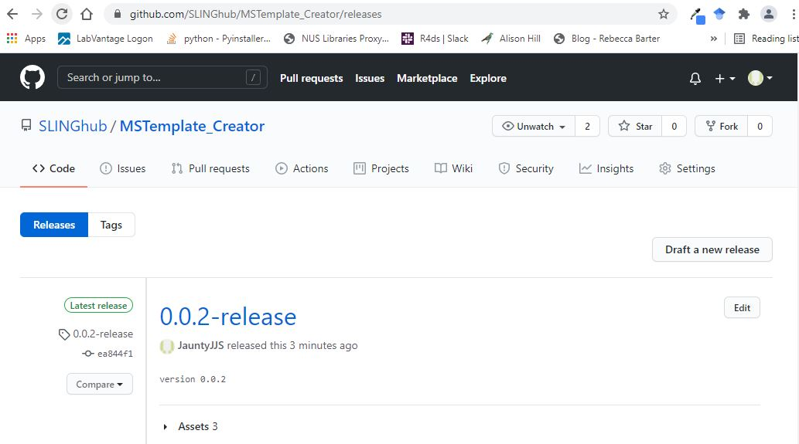

---
output:
  md_document:
    variant: markdown_github
---

```{r, include = FALSE}
knitr::opts_chunk$set(
  collapse = TRUE,
  comment = "#>",
  fig.align = 'center'
)
```

# MSTemplate_Creator

<!-- badges: start -->
[](https://github.com/SLINGhub/MSTemplate_Creator/blob/main/LICENSE.md)
[](https://github.com/JauntyJJS)
[](https://www.microsoft.com/en-sg/microsoft-365/excel)
<!-- badges: end -->

`MSTemplate_Creator` is an excel macro file created to provide users a more friendly interface to take in MRM transition names data exported directly from mass spectrometry software to create several annotation templates suited for automated data processing and statistical analysis.

# Table of Content

- [MSTemplate_Creator]
- [Table of Content]
- [Meta]
- [Starting Up]
- [Using Transition_Annot Sheet]
- [Using ISTD_Annot Sheet]
- [Using Sample_Annot Sheet]

# Meta

* We welcome contributions from general questions to bug reports. Check out the [contributions](CONTRIBUTING.md) guidelines. Please note that this project is released with a [Contributor Code of Conduct](https://www.contributor-covenant.org/version/2/0/code_of_conduct/). By participating in this project you agree to abide by its terms.
* License: [MIT](https://github.com/SLINGhub/MSTemplate_Creator/blob/main/LICENSE.md)
* Think `MSTemplate_Creator` is useful? Let others discover it, by telling them in person, via Twitter [](https://twitter.com/LOGIN) or a blog post. Do use the `🙌 Show and tell` under the [GitHub Discussions](https://github.com/SLINGhub/MSTemplate_Creator/discussions) and give this repository a star as well.


* If you wish to acknowledge the use of this software in a journal paper, please include the version number. For reproducibility, it is advisable to use the software from the [Releases](https://github.com/SLINGhub/MSTemplate_Creator/releases) section in GitHub rather than from the main branch.
* To date, the software is only able to take in the following files exported from the following software. 
  * csv files from [Agilent MassHunter Quantitative Analysis Software](https://www.agilent.com/en/product/software-informatics/mass-spectrometry-software/data-analysis/quantitative-analysis)
* Refer to the [NEWS.md file](https://github.com/SLINGhub/MSTemplate_Creator/blob/main/NEWS.md) to see what is being worked on as well as update to changes between back to back versions.

[Back to top](https://github.com/SLINGhub/MSTemplate_Creator#mstemplate_creator)

# Starting Up

Go to the [Releases](https://github.com/SLINGhub/MSTemplate_Creator/releases) section in GitHub.



Download the zip folder. Unzip the folder, double click on the excel macro file `MSTemplate_Creator.xlsm`` to start.


Upon opening you may encounter this security warning. Click on **Enable Content** so that the macro in the file will be activated.


[Back to top](https://github.com/SLINGhub/MSTemplate_Creator#mstemplate_creator)

# Using Transition_Annot Sheet

Load transition names from Agilent MRM data in csv file with **Load Transition_Name from Raw Data**


Load transition names from tabular data in csv file with **Load Transition_Name from Table Data**


Check the internal standards with **Validate ISTD**.


Once validated, transfer the internal standards to sheet `ISTD_Annot` with **Load ISTD to ISTD_Table**


[Back to top](https://github.com/SLINGhub/MSTemplate_Creator#mstemplate_creator)

# Using ISTD_Annot Sheet

Key in the concentration of the internal standard and convert to nM or other units to verify. Unit values under the column `Custom_Unit` can be used later to obtain the sample unit of concentration.


[Back to top](https://github.com/SLINGhub/MSTemplate_Creator#mstemplate_creator)

# Using Sample_Annot Sheet

Load sample names from Agilent MRM data in csv file with **Load Sample Annotation from Raw Data**. Use **Autofill 'Sample' in Sample_Type** to fill empty cells under the `Sample_Type` column with "SPL"


It is possible to merge Agilent MRM data with a sample annotation file in csv.


Load sample names from tabular data in csv file with **Load Sample Annotation from Table Data**. Use **Autofill 'Sample' in Sample_Type** to fill empty cells under the `Sample_Type` column with "SPL"


Next, fill in the `Sample_Amount`, `Sample_Amount_Unit` and the `ISTD_Mixture_Volume_[uL]` columns. If a particular `Sample_Type` has consistent inputs, the **Autofill by Sample_Type** button helps to fill in these consistent values quickly.


To obtain the analyte's concentration unit measured in each sample, go the `Sample_Annot` sheet and fill in the `Sample_Amount_Unit` for each sample. Next, on the `ISTD_Annot` sheet, select the concentration unit of the internal standard to use under the `Custom_Unit` column. Return to the `Sample_Annot` sheet and use **Autofill Concentration_Unit** to fill in the `Concentration_Unit` column.


Transfer Sample with QC sample type of "RQC" to `Dilution_Annot` sheet with **Load RQC Samples to Dilution_Table**


[Back to top](https://github.com/SLINGhub/MSTemplate_Creator#mstemplate_creator)
