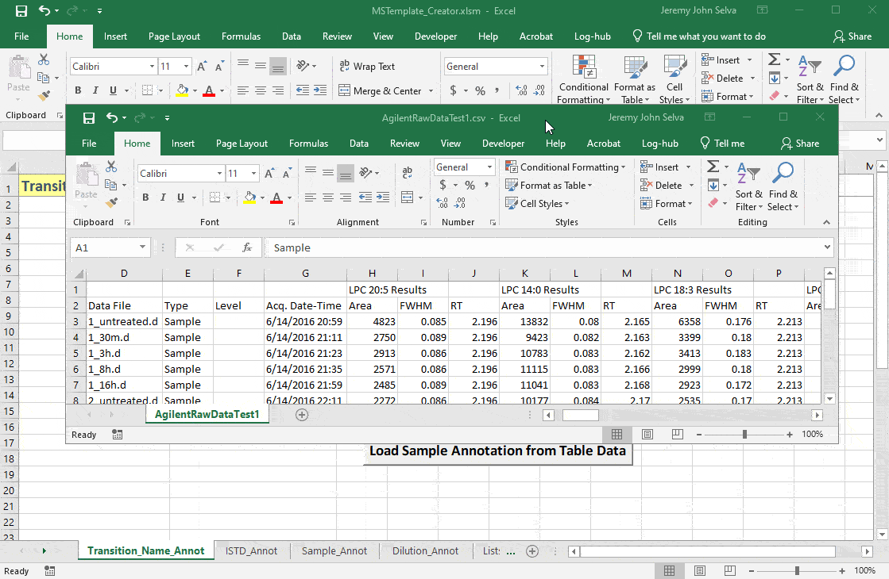

# MSTemplate\_Creator

MSTemplate\_Creator is an excel macro file created to provide users a
more friendly interface to take in MRM transition names data exported
directly from mass spectrometry software to create several annotation
templates suited for automated data processing and statistical analysis.

It is currently distributed as platform independent source code under
the MIT license.

## Starting Up

Download the repository and open the excel macro file
`MSTemplate_Creator.xlsm`

Upon opening you may encounter this security warning

Click on **Enable Content** so that the macro in the file will be
activated.

## Using Transition\_Annot Sheet

Load Agilent MRM data in csv file using the button Load Transition\_Name
from Raw Data

